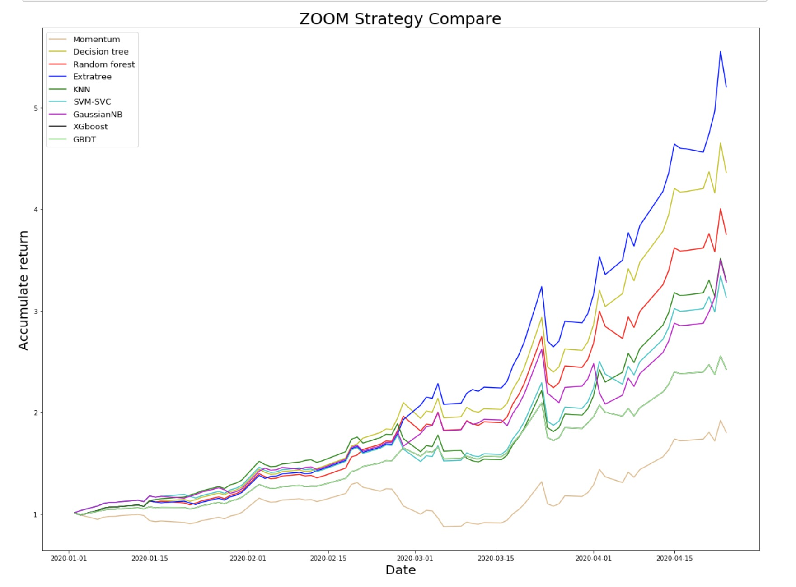

# twitter_predict_using_NLTK_and_some_machine_learning
This code mainly use NLTK and some machine learning skills to make a forecast,and mainly use for my own assignment.

The twitter code is scraped and only uploaded the clean version.

The extratreeClassifier is not accurate so i just delete from plot.

If you have some questions, feel free to contact[email:brayntyin@163.com],[wechat:Dick9233]

金融研究生 assignment，主要研究最近推特上对单只股票的情绪以及市场的情绪，整合部分技术指标 用算法去预测 accumulate return. 比较各种算法的优缺点

